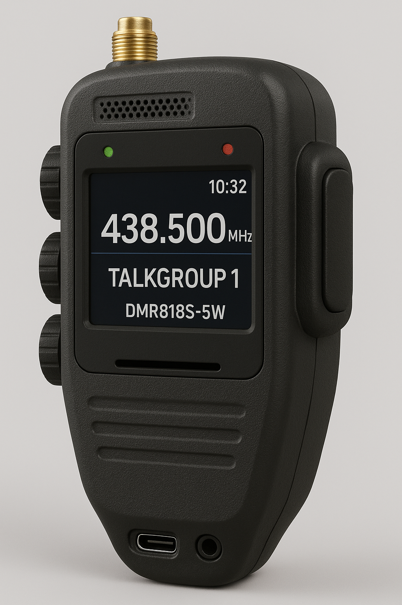

# Handheld Smart Microphone for DMR818S & DMR818S-5W

This project is an open hardware design for a **handheld smart microphone** built around the **DMR818S radio module** and **ESP32-S3**. It features a user-friendly form factor modeled after traditional handheld microphones, with modern enhancements including a 16-bit color display, onboard speaker and mic, side knobs for controlling Menus, Channel, Volume & Squelch, and USB-C connectivity.  Yes, it is essentially a DMR Transceiver but as it contains a ESP32 MCU, it will provide wireless and bluetooth connectivity to mobile devices for programming, and operation.  Specifically, it will provide a bluetooth connected device with the ability to send and receive DMR SMS messages.  The software hopes to use MicroPython with LVGL for the UI/UX.

---

## 🔧 Features

- 📡 **DMR818S radio module** (5W TX)
- 🧠 **ESP32-S3** MCU running LVGL + MicroPython
- 🎛️ Three rotary encoders with push buttons (Channel, Volume/Mute, Squelch)
- 🔊 Onboard I2S speaker amplifier + electret microphone
- 🎧 3.5mm TRRS headset jack (auto-switch)
- 🖥️ 2.4” ILI9341 SPI TFT display
- 🔋 5000mAh Li-ion battery with:
  - IP5306 charge + boost circuit
  - MAX17048 fuel gauge and battery protection
- 🔌 USB-C for charging and firmware upload
- 📶 SMA antenna connector on top
- 🚨 TX/RX LEDs, classic PTT side button
- Pololu U3V70F9 Boost Converter for DMR818S-5W which requires 7.4V @ 1.7A
- Bluetooth connectivity to provide for sending and receiving SMS messages via Mobile/PC

---

## 🔧 Additional Features

- **Programming**: Programmable with [CHiRP software](https://chirpmyradio.com/projects/chirp/wiki/Home)
- USB-C and/or Bluetooth connectivity also provides Audio interface for voice operation

---

## 📄 Schematic

See [`Handheld_Mic_Schematic.pdf`](Handheld_Mic_Schematic.pdf) for the full annotated schematic.

---

## 📷 Mockup

The physical form factor is designed to mimic classic handheld microphones, with:
- **Right-side PTT button** for thumb operation
- **Top-mounted SMA** and speaker grille
- **Side-mounted rotary encoder wheels**
- **USB-C and headset jack on the bottom**

Image reference: [`mockup.png`](mockup.png)

---

## ⚖️ License

This project is licensed under the **CERN Open Hardware License v2 - Strongly Reciprocal (CERN-OHL-S)**.

You may freely use, modify, and share the design for **non-commercial amateur radio purposes**.  
Modifications and derived works must be shared under the same license.

See [LICENSE](https://ohwr.org/cern_ohl_s_v2.txt) for full terms.

---

## 🚀 Status

- ⏳ Schematic (in progress)
- ❌ PCB layout (not started)
- ❌ Firmware scaffold (not started)
- ❌ Prototyping (not started)
- ❌ Manufacturing Finished Product (not started)

---

## 🤝 Contributing

Pull requests and community feedback are welcome! Please ensure any contributions follow the license terms.

---

# NICERF

See [DMR818S-5W Page](https://www.nicerf.com/walkie-talkie-module/dmr818S-5w.html) for more information on the main module used in this project.

# Current Requirements (DMR818S-5W)

| Voltage (V) | Output Power (dBm) | Output Power (W) | Current (mA) |
| ----------- | ------------------ | ---------------- | ------------ |
| **8.0V**    | 37.3 dBm           | \~5.37W          | **910 mA**   |
| **7.5V**    | 36.8 dBm           | \~4.79W          | 870 mA       |
| **7.0V**    | 36.2 dBm           | \~4.17W          | 830 mA       |

⚠️ Analog Mode Draws More!
At 8.0V, analog mode draws up to 1.7A for 5W.
So your power supply must handle ~2A peak current to be safe in analog.

- https://www.pololu.com/product/2890
